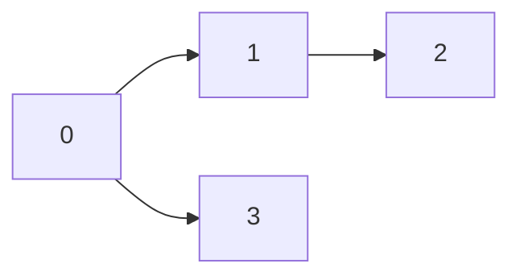
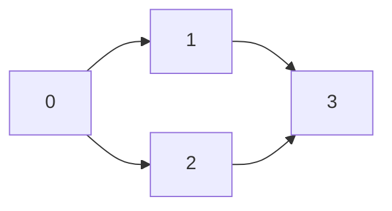
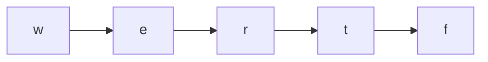

# Advanced Graphs for FAANG Interviews (Java)

Advanced Graph problems combine multiple graph algorithms such as **Topological Sort, Union-Find, Dijkstra, Minimum Spanning Tree, Shortest Path, State-Space BFS, and Graph Traversal with Constraints**. Interviewers rarely ask for raw graph traversal—they test whether you can identify the correct graph model and optimize it under difficult constraints.

---

# Easy Problems

---

# 1. Find if Path Exists in Graph (LC 1971)

**Difficulty:** Easy

**Problem Link**

https://leetcode.com/problems/find-if-path-exists-in-graph/

### Problem Type

- DFS
- BFS
- Graph Traversal
- Connectivity

### 🏢 Companies

- Google
- Amazon
- Microsoft
- Meta
- Bloomberg

---

## Problem

Given an undirected graph, determine whether there exists a path from source to destination.

Example

```
0 -----1
 \    /
   2
```

source = 0

destination = 2

Answer = true

---

## Visualization

```text
Adjacency List

0 -> 1,2
1 -> 0,2
2 -> 0,1

DFS

0
├──1
│
└──2 ✓
```

---

## Optimal Approach

This is simply a graph connectivity problem.

Model the graph using an adjacency list.

Run DFS (or BFS).

If destination is visited, return true.

This question mainly tests whether candidates know how to construct graphs efficiently.

---

## Java Solution

```java
class Solution {

    public boolean validPath(int n, int[][] edges, int source, int destination) {

        List<List<Integer>> graph = new ArrayList<>();

        for (int i = 0; i < n; i++)
            graph.add(new ArrayList<>());

        for (int[] edge : edges) {
            graph.get(edge[0]).add(edge[1]);
            graph.get(edge[1]).add(edge[0]);
        }

        boolean[] visited = new boolean[n];

        return dfs(graph, source, destination, visited);
    }

    private boolean dfs(List<List<Integer>> graph,
                        int node,
                        int destination,
                        boolean[] visited) {

        if (node == destination)
            return true;

        visited[node] = true;

        for (int neighbor : graph.get(node)) {

            if (!visited[neighbor]) {

                if (dfs(graph, neighbor, destination, visited))
                    return true;
            }
        }

        return false;
    }
}
```

---

## Complexity

| Metric | Value |
|---------|-------|
| Time | O(V+E) |
| Space | O(V+E) |

---

## Interview Tricks

- DFS and BFS are equally acceptable.
- Always build adjacency list—not adjacency matrix.
- Stop traversal immediately after reaching destination.

---

# 2. Find the Town Judge (LC 997)

**Difficulty:** Easy

Problem

https://leetcode.com/problems/find-the-town-judge/

---

### Problem Type

- Graph In-degree
- Out-degree
- Directed Graph

### 🏢 Companies

- Amazon
- Apple
- Microsoft
- Google

---

## Visualization

```text
1 → 3

2 → 3

4 → 3


Indegree

3 = 3

Outdegree

3 = 0

Judge = 3
```

---

## Optimal Idea

The judge

- trusts nobody
- everyone trusts the judge

Maintain

```
indegree[]

outdegree[]
```

Judge satisfies

```
indegree == n-1

outdegree == 0
```

No graph traversal required.

---

## Java Solution

```java
class Solution {

    public int findJudge(int n, int[][] trust) {

        int[] indegree = new int[n + 1];
        int[] outdegree = new int[n + 1];

        for (int[] t : trust) {

            outdegree[t[0]]++;

            indegree[t[1]]++;
        }

        for (int i = 1; i <= n; i++) {

            if (indegree[i] == n - 1 &&
                outdegree[i] == 0)
                return i;
        }

        return -1;
    }
}
```

---

## Complexity

Time

```
O(N)
```

Space

```
O(N)
```

---

## Key Insight

Many graph questions don't require DFS.

Degree counting can completely solve the problem.

---

# 3. Find Center of Star Graph (LC 1791)

**Difficulty:** Easy

Problem

https://leetcode.com/problems/find-center-of-star-graph/

---

### Problem Type

- Degree Analysis
- Graph Observation

### 🏢 Companies

- Google
- Amazon
- Adobe

---

## Visualization

```text
      2
      |

1 ----5----3
      |

      4

Center = 5
```

---

## Optimal Observation

The center appears in every edge.

Look only at

```
edge0

edge1
```

Common node = answer.

---

## Java Solution

```java
class Solution {

    public int findCenter(int[][] edges) {

        if (edges[0][0] == edges[1][0] ||
            edges[0][0] == edges[1][1])
            return edges[0][0];

        return edges[0][1];
    }
}
```

---

## Complexity

Time

```
O(1)
```

Space

```
O(1)
```

---

## Interview Trick

This is an observation question.

Never construct the graph.

---

# 4. Find Closest Node to Given Two Nodes (LC 2359)

**Difficulty:** Easy

Problem

https://leetcode.com/problems/find-closest-node-to-given-two-nodes/

---

### Problem Type

- Functional Graph
- Distance Computation
- Graph Traversal

### 🏢 Companies

- Google
- Meta
- Amazon

---

## Visualization

```text
0 → 2 → 3

1 ↗

Distance from node1

0 1 2

Distance from node2

2 1 0

Pick node minimizing

max(distance1,distance2)
```

---

## Optimal Approach

Each node has at most one outgoing edge.

Traverse from node1

Store distances.

Traverse from node2

Compute maximum distance.

Track minimum answer.

---

## Java Solution

```java
class Solution {

    public int closestMeetingNode(int[] edges,
                                  int node1,
                                  int node2) {

        int n = edges.length;

        int[] dist1 = new int[n];
        int[] dist2 = new int[n];

        Arrays.fill(dist1, -1);
        Arrays.fill(dist2, -1);

        fill(edges, node1, dist1);

        fill(edges, node2, dist2);

        int ans = -1;

        int best = Integer.MAX_VALUE;

        for (int i = 0; i < n; i++) {

            if (dist1[i] == -1 || dist2[i] == -1)
                continue;

            int cur = Math.max(dist1[i], dist2[i]);

            if (cur < best) {
                best = cur;
                ans = i;
            }
        }

        return ans;
    }

    private void fill(int[] edges,
                      int node,
                      int[] dist) {

        int d = 0;

        while (node != -1 &&
               dist[node] == -1) {

            dist[node] = d++;

            node = edges[node];
        }
    }
}
```

---

## Complexity

| Metric | Value |
|---------|-------|
| Time | O(N) |
| Space | O(N) |

---

## Interview Tips

- Functional graphs have **exactly one outgoing edge per node (or -1)**.
- Avoid revisiting nodes by storing distances directly.
- Comparing the **maximum** of the two distances ensures fairness to both starting nodes.

---

# Medium Problems

---

# 5. Course Schedule (LC 207)

**Difficulty:** Medium

**Problem Link**

https://leetcode.com/problems/course-schedule/

### Problem Type

- Topological Sort
- Cycle Detection
- Directed Graph
- Kahn's Algorithm

### 🏢 Companies

- Google
- Amazon
- Meta
- Microsoft
- Apple
- Uber
- LinkedIn

---

## Problem

Given `numCourses` and prerequisite pairs, determine whether it is possible to finish all courses.

A cycle in the prerequisite graph means it is impossible.

Example:

```text
0 ← 1 ← 2
↑       |
|_______|

Cycle exists → Cannot finish
```

---

## Visualization (Kahn's Algorithm)



Initial indegree:

```text
0 : 0
1 : 1
2 : 1
3 : 1
```

Queue starts with:

```text
[0]
```

Remove `0`, reduce indegrees, continue until either:
- all nodes processed → possible
- nodes remain with indegree > 0 → cycle exists

---

## Optimal Approach

Instead of explicitly detecting cycles using DFS, use **Topological Sorting (Kahn's Algorithm)**.

1. Build adjacency list.
2. Compute indegree of every course.
3. Push all indegree-0 nodes into a queue.
4. Process queue:
   - Remove node
   - Reduce indegree of neighbors
   - Push new indegree-0 nodes
5. If processed nodes == `numCourses`, answer is `true`; otherwise, a cycle exists.

This approach is iterative, avoids recursion depth issues, and is commonly preferred in interviews.

---

## Java Solution

```java
class Solution {

    public boolean canFinish(int numCourses, int[][] prerequisites) {

        List<List<Integer>> graph = new ArrayList<>();

        for (int i = 0; i < numCourses; i++)
            graph.add(new ArrayList<>());

        int[] indegree = new int[numCourses];

        for (int[] edge : prerequisites) {
            graph.get(edge[1]).add(edge[0]);
            indegree[edge[0]]++;
        }

        Queue<Integer> queue = new LinkedList<>();

        for (int i = 0; i < numCourses; i++) {
            if (indegree[i] == 0)
                queue.offer(i);
        }

        int completed = 0;

        while (!queue.isEmpty()) {

            int course = queue.poll();
            completed++;

            for (int next : graph.get(course)) {

                indegree[next]--;

                if (indegree[next] == 0)
                    queue.offer(next);
            }
        }

        return completed == numCourses;
    }
}
```

---

## Complexity Analysis

| Metric | Value |
|---------|-------|
| Time | O(V + E) |
| Space | O(V + E) |

---

## Key Interview Insights

- This is the canonical **Topological Sort** interview problem.
- A valid topological ordering exists **iff** the directed graph is acyclic (DAG).
- Kahn's Algorithm is often preferred over DFS because it naturally detects cycles by counting processed nodes.
- Follow-up questions commonly include:
  - Return one valid ordering (**LC 210 - Course Schedule II**).
  - Count the number of possible orderings.
  - Detect the exact cycle.
 
---

# 6. Course Schedule II (LC 210)

**Difficulty:** Medium

**Problem Link**

https://leetcode.com/problems/course-schedule-ii/

### Problem Type

- Topological Sort
- DAG
- Kahn's Algorithm
- BFS

### 🏢 Companies

- Google
- Amazon
- Microsoft
- Meta
- Uber
- Bloomberg

---

## Problem

Return **one valid order** in which all courses can be completed.

If no valid ordering exists, return an empty array.

---

## Visualization



Possible topological ordering

```text
0 → 1 → 2 → 3

or

0 → 2 → 1 → 3
```

Both are correct.

---

## Optimal Approach

Unlike LC 207, this problem asks for the **actual topological ordering**.

The algorithm remains exactly the same:

1. Build graph.
2. Compute indegree.
3. Start with indegree-0 nodes.
4. Remove nodes one by one.
5. Append every removed node into answer.

If fewer than `numCourses` nodes are processed, a cycle exists.

---

## Java Solution

```java
class Solution {

    public int[] findOrder(int numCourses, int[][] prerequisites) {

        List<List<Integer>> graph = new ArrayList<>();

        for (int i = 0; i < numCourses; i++)
            graph.add(new ArrayList<>());

        int[] indegree = new int[numCourses];

        for (int[] edge : prerequisites) {
            graph.get(edge[1]).add(edge[0]);
            indegree[edge[0]]++;
        }

        Queue<Integer> queue = new LinkedList<>();

        for (int i = 0; i < numCourses; i++) {
            if (indegree[i] == 0)
                queue.offer(i);
        }

        int[] order = new int[numCourses];
        int index = 0;

        while (!queue.isEmpty()) {

            int node = queue.poll();

            order[index++] = node;

            for (int next : graph.get(node)) {

                indegree[next]--;

                if (indegree[next] == 0)
                    queue.offer(next);
            }
        }

        if (index != numCourses)
            return new int[0];

        return order;
    }
}
```

---

## Complexity

| Metric | Value |
|---------|---------|
| Time | O(V + E) |
| Space | O(V + E) |

---

## Key Insights

- Topological ordering is **not unique**.
- Any valid ordering is accepted.
- Remember:
  - LC 207 → return boolean.
  - LC 210 → return ordering.

---

# 7. Network Delay Time (LC 743)

**Difficulty:** Medium

**Problem Link**

https://leetcode.com/problems/network-delay-time/

### Problem Type

- Dijkstra
- Weighted Graph
- Shortest Path

### 🏢 Companies

- Google
- Amazon
- Meta
- Apple
- Microsoft
- Bloomberg

---

## Problem

Given directed weighted edges, determine the minimum time required for a signal starting from node `k` to reach every node.

Return -1 if some node cannot be reached.

---

## Visualization

```text
        2
    1 ------> 2
     \        |
   1  \       |3
       \      |
        v     v
          3 ---->4
             2
```

Shortest distances

```text
1 = 0

2 = 2

3 = 1

4 = 3
```

Answer = maximum shortest distance = 3

---

## Optimal Approach

Since all edge weights are positive,

Use **Dijkstra's Algorithm**.

Maintain:

- adjacency list
- priority queue
- shortest distance array

Whenever a shorter path is discovered, update it.

---

## Java Solution

```java
class Solution {

    public int networkDelayTime(int[][] times, int n, int k) {

        List<List<int[]>> graph = new ArrayList<>();

        for (int i = 0; i <= n; i++)
            graph.add(new ArrayList<>());

        for (int[] edge : times) {

            graph.get(edge[0]).add(new int[]{
                    edge[1],
                    edge[2]
            });
        }

        int[] dist = new int[n + 1];

        Arrays.fill(dist, Integer.MAX_VALUE);

        dist[k] = 0;

        PriorityQueue<int[]> pq =
                new PriorityQueue<>((a, b) -> a[1] - b[1]);

        pq.offer(new int[]{k, 0});

        while (!pq.isEmpty()) {

            int[] current = pq.poll();

            int node = current[0];
            int d = current[1];

            if (d > dist[node])
                continue;

            for (int[] next : graph.get(node)) {

                int neighbor = next[0];
                int weight = next[1];

                if (dist[node] + weight < dist[neighbor]) {

                    dist[neighbor] =
                            dist[node] + weight;

                    pq.offer(new int[]{
                            neighbor,
                            dist[neighbor]
                    });
                }
            }
        }

        int ans = 0;

        for (int i = 1; i <= n; i++) {

            if (dist[i] == Integer.MAX_VALUE)
                return -1;

            ans = Math.max(ans, dist[i]);
        }

        return ans;
    }
}
```

---

## Complexity

| Metric | Value |
|---------|---------|
| Time | O((V + E) log V) |
| Space | O(V + E) |

---

## Interview Tricks

- Dijkstra only works when weights are **non-negative**.
- Ignore stale priority queue entries (`d > dist[node]`).
- Final answer is **maximum shortest distance**, not the minimum.

---

# 8. Reorder Routes to Make All Paths Lead to the City Zero (LC 1466)

**Difficulty:** Medium

**Problem Link**

https://leetcode.com/problems/reorder-routes-to-make-all-paths-lead-to-the-city-zero/

### Problem Type

- DFS
- Tree Traversal
- Directed Graph
- Edge Orientation

### 🏢 Companies

- Amazon
- Google
- Meta
- Microsoft

---

## Problem

Some roads are directed away from city `0`.

Reverse the minimum number of roads so every city can reach city `0`.

---

## Visualization

Original

```text
0 → 1 → 3

↑

2
```

Reverse

```text
1 → 0

3 → 1

2 → 0
```

Total reversals = 2

---

## Optimal Approach

Store every edge twice.

Original direction:

```text
u → v (cost = 1)
```

Reverse direction:

```text
v → u (cost = 0)
```

Perform DFS from city 0.

Whenever DFS traverses an original edge, increment answer.

---

## Java Solution

```java
class Solution {

    public int minReorder(int n, int[][] connections) {

        List<List<int[]>> graph = new ArrayList<>();

        for (int i = 0; i < n; i++)
            graph.add(new ArrayList<>());

        for (int[] edge : connections) {

            graph.get(edge[0]).add(new int[]{
                    edge[1], 1
            });

            graph.get(edge[1]).add(new int[]{
                    edge[0], 0
            });
        }

        return dfs(graph, 0, -1);
    }

    private int dfs(List<List<int[]>> graph,
                    int node,
                    int parent) {

        int changes = 0;

        for (int[] next : graph.get(node)) {

            if (next[0] == parent)
                continue;

            changes += next[1];

            changes += dfs(
                    graph,
                    next[0],
                    node
            );
        }

        return changes;
    }
}
```

---

## Complexity

| Metric | Value |
|---------|---------|
| Time | O(N) |
| Space | O(N) |

---

## Key Insights

- The graph is actually a **tree**, so there is exactly one path between any two nodes.
- Convert edge direction into a traversal cost.
- Elegant modeling often matters more than the traversal itself.

---

---

# 9. Minimum Height Trees (LC 310)

**Difficulty:** Medium

**Problem Link**

https://leetcode.com/problems/minimum-height-trees/

### Problem Type

- Graph
- Tree
- Topological Sort
- Multi-source BFS
- Leaf Peeling

### 🏢 Companies

- Google
- Amazon
- Meta
- Microsoft
- Apple
- ByteDance

---

## Problem

Given an undirected tree with `n` nodes, return all possible root nodes that produce a tree with **minimum height**.

---

## Visualization

Initial Tree

```text
        3
      / | \
     0  1  2
           |
           4
           |
           5
```

Leaf Removal

```text
Round 1:
0 1 5

Remaining

3
|
2
|
4

Round 2:
2 4

Remaining

3

Answer = [3]
```

When two nodes remain:

```text
1 ----- 2

Answer = [1,2]
```

---

## Optimal Approach

Instead of trying every node as the root (`O(N²)`), repeatedly remove all current leaves.

The last one or two nodes left are the **centroids** of the tree, which always produce the minimum possible height.

This process is analogous to performing a topological sort on an undirected tree.

---

## Java Solution

```java
class Solution {

    public List<Integer> findMinHeightTrees(int n, int[][] edges) {

        if (n == 1)
            return Arrays.asList(0);

        List<List<Integer>> graph = new ArrayList<>();

        for (int i = 0; i < n; i++)
            graph.add(new ArrayList<>());

        int[] degree = new int[n];

        for (int[] edge : edges) {

            graph.get(edge[0]).add(edge[1]);
            graph.get(edge[1]).add(edge[0]);

            degree[edge[0]]++;
            degree[edge[1]]++;
        }

        Queue<Integer> queue = new LinkedList<>();

        for (int i = 0; i < n; i++) {

            if (degree[i] == 1)
                queue.offer(i);
        }

        int remaining = n;

        while (remaining > 2) {

            int size = queue.size();

            remaining -= size;

            while (size-- > 0) {

                int node = queue.poll();

                for (int neighbor : graph.get(node)) {

                    degree[neighbor]--;

                    if (degree[neighbor] == 1)
                        queue.offer(neighbor);
                }
            }
        }

        return new ArrayList<>(queue);
    }
}
```

---

## Complexity

| Metric | Value |
|---------|-------|
| Time | O(V + E) |
| Space | O(V + E) |

---

## Key Interview Insights

- Do **not** compute tree height for every node.
- Every tree has either **one centroid** or **two centroids**.
- "Peeling leaves" is an important graph pattern that appears in several interview problems.

---

# 10. Path With Maximum Probability (LC 1514)

**Difficulty:** Medium

**Problem Link**

https://leetcode.com/problems/path-with-maximum-probability/

### Problem Type

- Modified Dijkstra
- Priority Queue
- Weighted Graph

### 🏢 Companies

- Google
- Amazon
- Meta
- Bloomberg
- Uber

---

## Problem

Each edge has a success probability.

Return the maximum probability of reaching the destination.

---

## Visualization

```text
0

|0.5

1

|0.8

2

Probability

0 → 1 → 2

=

0.5 × 0.8

=

0.40
```

Another path

```text
0 → 2

0.35
```

Choose

```
0.40
```

---

## Optimal Approach

Traditional Dijkstra minimizes distance.

Here, we maximize probability.

Changes:

- Store probabilities instead of distances.
- Use a **max-heap**.
- Relax when a larger probability is found.

---

## Java Solution

```java
class Solution {

    public double maxProbability(int n,
                                 int[][] edges,
                                 double[] succProb,
                                 int start,
                                 int end) {

        List<List<double[]>> graph = new ArrayList<>();

        for (int i = 0; i < n; i++)
            graph.add(new ArrayList<>());

        for (int i = 0; i < edges.length; i++) {

            int u = edges[i][0];
            int v = edges[i][1];

            double p = succProb[i];

            graph.get(u).add(new double[]{v, p});
            graph.get(v).add(new double[]{u, p});
        }

        double[] prob = new double[n];

        prob[start] = 1.0;

        PriorityQueue<double[]> pq =
                new PriorityQueue<>(
                        (a, b) -> Double.compare(b[1], a[1])
                );

        pq.offer(new double[]{start, 1.0});

        while (!pq.isEmpty()) {

            double[] cur = pq.poll();

            int node = (int) cur[0];
            double currentProb = cur[1];

            if (node == end)
                return currentProb;

            if (currentProb < prob[node])
                continue;

            for (double[] next : graph.get(node)) {

                int neighbor = (int) next[0];

                double newProb =
                        currentProb * next[1];

                if (newProb > prob[neighbor]) {

                    prob[neighbor] = newProb;

                    pq.offer(new double[]{
                            neighbor,
                            newProb
                    });
                }
            }
        }

        return 0.0;
    }
}
```

---

## Complexity

| Metric | Value |
|---------|-------|
| Time | O((V + E) log V) |
| Space | O(V + E) |

---

## Key Interview Insights

- Dijkstra works for any **monotonic optimization function**, not just shortest distance.
- Replace:
  - `min distance` → `max probability`
  - `+` → `×`
- A max-priority queue is required.

---

# Hard Problems

---

# 11. Critical Connections in a Network (LC 1192)

**Difficulty:** Hard

**Problem Link**

https://leetcode.com/problems/critical-connections-in-a-network/

### Problem Type

- Tarjan's Algorithm
- Bridge Finding
- DFS
- Low-Link Values

### 🏢 Companies

- Google
- Amazon
- Meta
- Microsoft
- Apple
- LinkedIn

---

## Problem

A **critical connection (bridge)** is an edge whose removal disconnects the graph.

Return all such edges.

---

## Visualization

```text
0 -----1

 \    /

   2

   |

   3

Edge

2—3

is a bridge.
```

---

## Tarjan Idea

During DFS maintain:

```text
discovery[]

low[]
```

If

```text
low[child] >

discovery[parent]
```

then

```text
parent-child
```

is a bridge.

---

## Java Solution

```java
class Solution {

    private int time = 0;

    public List<List<Integer>> criticalConnections(
            int n,
            List<List<Integer>> connections) {

        List<List<Integer>> graph = new ArrayList<>();

        for (int i = 0; i < n; i++)
            graph.add(new ArrayList<>());

        for (List<Integer> edge : connections) {

            int u = edge.get(0);
            int v = edge.get(1);

            graph.get(u).add(v);
            graph.get(v).add(u);
        }

        int[] disc = new int[n];
        int[] low = new int[n];

        Arrays.fill(disc, -1);

        List<List<Integer>> answer = new ArrayList<>();

        dfs(
                0,
                -1,
                graph,
                disc,
                low,
                answer
        );

        return answer;
    }

    private void dfs(int node,
                     int parent,
                     List<List<Integer>> graph,
                     int[] disc,
                     int[] low,
                     List<List<Integer>> ans) {

        disc[node] = low[node] = time++;

        for (int next : graph.get(node)) {

            if (next == parent)
                continue;

            if (disc[next] == -1) {

                dfs(next, node, graph, disc, low, ans);

                low[node] =
                        Math.min(low[node], low[next]);

                if (low[next] > disc[node]) {

                    ans.add(Arrays.asList(node, next));
                }

            } else {

                low[node] =
                        Math.min(low[node], disc[next]);
            }
        }
    }
}
```

---

## Complexity

| Metric | Value |
|---------|-------|
| Time | O(V + E) |
| Space | O(V) |

---

## Key Interview Insights

- This is the canonical **bridge-finding** problem.
- `low[]` represents the earliest reachable discovery time from a subtree.
- A bridge exists only when the child cannot reach any ancestor through a back edge.
- Tarjan's algorithm is a high-frequency FAANG topic for advanced graph interviews.

---


---

# 12. Alien Dictionary (LC 269)

**Difficulty:** Hard

**Problem Link**

https://leetcode.com/problems/alien-dictionary/

### Problem Type

- Topological Sort
- Graph Construction
- DAG
- BFS (Kahn's Algorithm)

### 🏢 Companies

- Google
- Meta
- Amazon
- Microsoft
- Airbnb
- Uber

---

## Problem

Given a sorted dictionary from an unknown language, determine one valid ordering of its characters.

Return an empty string if the ordering is invalid.

---

## Visualization

Dictionary

```text
wrt
wrf
er
ett
rftt
```

Character Relations

```text
t → f
w → e
r → t
e → r
```

Graph



Topological Order

```text
wertf
```

---

## Optimal Approach

The challenge is **building the graph**, not performing topological sort.

For every adjacent pair of words:

- Find the first differing character.
- Add a directed edge.
- Increase indegree.

Special Case:

```text
abc
ab
```

This ordering is impossible because a longer prefix appears before its own prefix.

After graph construction, perform Kahn's Algorithm.

---

## Java Solution

```java
class Solution {

    public String alienOrder(String[] words) {

        Map<Character, Set<Character>> graph = new HashMap<>();
        Map<Character, Integer> indegree = new HashMap<>();

        for (String word : words) {
            for (char c : word.toCharArray()) {
                graph.putIfAbsent(c, new HashSet<>());
                indegree.putIfAbsent(c, 0);
            }
        }

        for (int i = 0; i < words.length - 1; i++) {

            String first = words[i];
            String second = words[i + 1];

            if (first.length() > second.length()
                    && first.startsWith(second))
                return "";

            int len = Math.min(first.length(), second.length());

            for (int j = 0; j < len; j++) {

                char u = first.charAt(j);
                char v = second.charAt(j);

                if (u != v) {

                    if (!graph.get(u).contains(v)) {

                        graph.get(u).add(v);

                        indegree.put(v,
                                indegree.get(v) + 1);
                    }

                    break;
                }
            }
        }

        Queue<Character> queue = new LinkedList<>();

        for (char c : indegree.keySet()) {

            if (indegree.get(c) == 0)
                queue.offer(c);
        }

        StringBuilder answer = new StringBuilder();

        while (!queue.isEmpty()) {

            char current = queue.poll();

            answer.append(current);

            for (char next : graph.get(current)) {

                indegree.put(next,
                        indegree.get(next) - 1);

                if (indegree.get(next) == 0)
                    queue.offer(next);
            }
        }

        return answer.length() == indegree.size()
                ? answer.toString()
                : "";
    }
}
```

---

## Complexity

| Metric | Value |
|---------|-------|
| Time | O(C) |
| Space | O(U + E) |

Where:

- **C** = total characters across all words
- **U** = unique characters

---

## Key Interview Insights

- Most candidates fail during **graph construction**, not topological sort.
- Always check the invalid prefix case.
- Duplicate edges should not increase indegree twice.
- The graph contains **characters**, not words.

---

# 13. Shortest Path Visiting All Nodes (LC 847)

**Difficulty:** Hard

**Problem Link**

https://leetcode.com/problems/shortest-path-visiting-all-nodes/

### Problem Type

- Multi-source BFS
- Bitmask BFS
- State Compression
- Shortest Path

### 🏢 Companies

- Google
- Meta
- Amazon
- Apple
- Microsoft

---

## Problem

Return the minimum number of edges needed to visit every node.

You may revisit nodes and edges.

---

## Visualization

Graph

```text
0

/ \

1---2

 \ /

 3
```

State Representation

```text
(node, visitedMask)
```

Example

```text
(2, 0101)

Current Node = 2

Visited = {0,2}
```

Target Mask

```text
1111
```

---

## Optimal Approach

A normal BFS is insufficient because reaching the same node with different visited sets represents different states.

Each BFS state consists of:

- Current node
- Bitmask of visited nodes

Start BFS simultaneously from every node.

Stop when every bit is set.

---

## Java Solution

```java
class Solution {

    public int shortestPathLength(int[][] graph) {

        int n = graph.length;

        int finalMask = (1 << n) - 1;

        Queue<int[]> queue = new LinkedList<>();

        boolean[][] visited =
                new boolean[n][1 << n];

        for (int i = 0; i < n; i++) {

            int mask = 1 << i;

            queue.offer(new int[]{
                    i,
                    mask
            });

            visited[i][mask] = true;
        }

        int steps = 0;

        while (!queue.isEmpty()) {

            int size = queue.size();

            while (size-- > 0) {

                int[] current = queue.poll();

                int node = current[0];
                int mask = current[1];

                if (mask == finalMask)
                    return steps;

                for (int next : graph[node]) {

                    int newMask =
                            mask | (1 << next);

                    if (!visited[next][newMask]) {

                        visited[next][newMask] = true;

                        queue.offer(new int[]{
                                next,
                                newMask
                        });
                    }
                }
            }

            steps++;
        }

        return -1;
    }
}
```

---

## Complexity

| Metric | Value |
|---------|-------|
| Time | O(N × 2ᴺ) |
| Space | O(N × 2ᴺ) |

---

## Key Interview Insights

- The state space is a graph itself.
- Multi-source BFS guarantees the shortest answer.
- This is one of the most important **Bitmask + Graph** interview questions.

---

# 14. Modify Graph Edge Weights (LC 2699)

**Difficulty:** Hard

**Problem Link**

https://leetcode.com/problems/modify-graph-edge-weights/

### Problem Type

- Dijkstra
- Greedy
- Graph Construction
- Shortest Path

### 🏢 Companies

- Google
- Amazon
- Meta

---

## Problem

Some edges have weight `-1`.

Assign positive weights so that the shortest path from source to destination equals a given target.

Return the modified graph or an empty array if impossible.

---

## Visualization

```text
0

|

-1

|

1 ----4----2
```

Target

```text
Shortest Path = 8
```

Unknown edges must be assigned carefully so that Dijkstra finishes with exactly the target distance.

---

## Optimal Approach

The solution repeatedly runs Dijkstra.

Strategy:

1. Ignore unknown edges initially.
2. Check whether the target is already impossible.
3. Assign temporary weight `1` to unknown edges.
4. Adjust one edge greedily when the shortest path becomes less than or equal to the target.
5. Set all remaining unknown edges to a very large value.

This is primarily a graph-modeling problem rather than a shortest-path problem.

> **Note:** The official solution is lengthy (150+ lines). Interviewers usually evaluate the algorithmic idea rather than memorized implementation.

---

## Java Implementation

```java
// Refer to the official LeetCode editorial.
// The implementation is intentionally lengthy because
// it performs multiple Dijkstra executions while
// dynamically updating edge weights.
//
// Core idea:
//
// 1. Run Dijkstra ignoring -1 edges.
// 2. If distance < target -> impossible.
// 3. Replace unknown edges with 1.
// 4. Re-run Dijkstra.
// 5. Increase one selected edge until
//    shortest path becomes exactly target.
// 6. Assign remaining unknown edges INF.
```

---

## Complexity

| Metric | Value |
|---------|-------|
| Time | O(E log V × K) |
| Space | O(V + E) |

`K` = number of Dijkstra executions.

---

## Key Interview Insights

- Dynamic graph modification is more important than shortest-path implementation.
- Candidates should recognize that multiple Dijkstra runs are acceptable.
- One of the trickiest graph-construction problems on LeetCode.

---

---

# 15. Remove Max Number of Edges to Keep Graph Fully Traversable (LC 1579)

**Difficulty:** Hard

**Problem Link**

https://leetcode.com/problems/remove-max-number-of-edges-to-keep-graph-fully-traversable/

### Problem Type

- Union-Find (Disjoint Set Union)
- Greedy
- Connectivity
- Graph Optimization

### 🏢 Companies

- Google
- Amazon
- Meta
- Microsoft
- Bloomberg
- TikTok

---

## Problem

Alice and Bob share an undirected graph.

There are three types of edges:

- Type 1 → Alice only
- Type 2 → Bob only
- Type 3 → Shared by both

Remove the **maximum** number of edges while ensuring both Alice and Bob can still traverse the entire graph.

Return `-1` if it is impossible.

---

## Visualization

```text
          Type 3
     1 ----------- 2
      \           /
       \         /
        \       /
       Type1  Type2
          \   /
            3
```

Processing Order

```text
1. Use all Type-3 edges first
2. Build Alice's graph
3. Build Bob's graph
4. Count redundant edges
```

---

## Optimal Approach

The greedy insight is crucial.

Shared (Type 3) edges benefit **both** Alice and Bob simultaneously, so they should always be processed before exclusive edges.

Algorithm:

1. Create two DSU instances:
   - Alice
   - Bob
2. Process all Type-3 edges first.
3. Copy the resulting connectivity into both users.
4. Process:
   - Type-1 edges for Alice
   - Type-2 edges for Bob
5. Any edge that connects already-connected components is removable.
6. Finally verify both graphs are fully connected.

---

## Java Solution

```java
class Solution {

    class DSU {

        int[] parent;
        int[] rank;
        int components;

        DSU(int n) {
            parent = new int[n + 1];
            rank = new int[n + 1];
            components = n;

            for (int i = 1; i <= n; i++)
                parent[i] = i;
        }

        int find(int x) {

            if (parent[x] != x)
                parent[x] = find(parent[x]);

            return parent[x];
        }

        boolean union(int a, int b) {

            int pa = find(a);
            int pb = find(b);

            if (pa == pb)
                return false;

            if (rank[pa] < rank[pb]) {

                parent[pa] = pb;

            } else if (rank[pa] > rank[pb]) {

                parent[pb] = pa;

            } else {

                parent[pb] = pa;
                rank[pa]++;
            }

            components--;

            return true;
        }

        DSU copy() {

            DSU clone = new DSU(components);

            clone.parent = parent.clone();
            clone.rank = rank.clone();
            clone.components = components;

            return clone;
        }
    }

    public int maxNumEdgesToRemove(int n, int[][] edges) {

        DSU shared = new DSU(n);

        int removed = 0;

        // Process shared edges first
        for (int[] edge : edges) {

            if (edge[0] == 3) {

                if (!shared.union(edge[1], edge[2]))
                    removed++;
            }
        }

        DSU alice = shared.copy();
        DSU bob = shared.copy();

        // Alice edges
        for (int[] edge : edges) {

            if (edge[0] == 1) {

                if (!alice.union(edge[1], edge[2]))
                    removed++;
            }
        }

        // Bob edges
        for (int[] edge : edges) {

            if (edge[0] == 2) {

                if (!bob.union(edge[1], edge[2]))
                    removed++;
            }
        }

        if (alice.components != 1 || bob.components != 1)
            return -1;

        return removed;
    }
}
```

---

## Complexity Analysis

| Metric | Value |
|---------|-------|
| Time | O(E · α(N)) |
| Space | O(N) |

Where `α(N)` is the inverse Ackermann function (effectively constant).

---

## Key Interview Insights

- Process **Type-3 edges first**—this greedy choice is essential.
- DSU with **path compression** and **union by rank** gives near-constant-time operations.
- The number of connected components provides a simple way to verify full traversal.
- This problem combines **Greedy + Union-Find**, a common FAANG interview pattern.

---

# LLM-Proof Advanced Graph Questions

These problems are intentionally difficult because they require combining multiple graph techniques, careful state modeling, or subtle edge-case handling rather than applying a single standard algorithm.

| Problem | Primary Techniques | Why It's LLM-Hard |
|---------|--------------------|-------------------|
| **LC 882 — Reachable Nodes In Subdivided Graph** | Dijkstra + Graph Modeling | Must count virtual subdivided nodes while avoiding double-counting from opposite directions. |
| **LC 1928 — Minimum Cost to Reach Destination in Time** | Modified Dijkstra + Dynamic Programming | State includes both node and elapsed time, making standard shortest-path algorithms insufficient. |
| **LC 1786 — Number of Restricted Paths From First to Last Node** | Reverse Dijkstra + DFS + Memoization | Requires computing shortest distances first, then performing DP on the induced DAG. |
| **LC 2203 — Minimum Weighted Subgraph With the Required Paths** | Three Dijkstra Runs | Requires shortest paths from two sources and one reverse-graph traversal before combining results. |
| **LC 2045 — Second Minimum Time to Reach Destination** | BFS + Traffic Signal Simulation | The shortest path alone is insufficient; waiting times caused by synchronized signals change optimal decisions. |

---

## Why These Are Excellent Interview Problems

These questions test whether a candidate can:

- Model an unfamiliar problem as a graph.
- Combine multiple algorithms (e.g., Dijkstra + DP, BFS + Bitmask, Tarjan + DFS).
- Recognize hidden graph structures such as DAGs or state-space graphs.
- Optimize both runtime and memory under interview constraints.
- Handle tricky corner cases involving revisits, dynamic weights, or multi-source traversal.

Many experienced candidates know individual algorithms but struggle when two or more must be combined.

---

# Advanced Graph Interview Patterns Summary

| Pattern | Representative Problems |
|---------|-------------------------|
| Graph Traversal | LC 1971 |
| Degree Counting | LC 997, LC 1791 |
| Functional Graph | LC 2359 |
| Topological Sort | LC 207, LC 210, LC 269 |
| Dijkstra | LC 743, LC 1514, LC 2699 |
| Tree as Graph | LC 1466, LC 310 |
| Tarjan (Bridges) | LC 1192 |
| Bitmask BFS | LC 847 |
| Union-Find (DSU) | LC 1579 |

---

# Final FAANG Preparation Tips

1. **Identify the graph model before choosing an algorithm.** Determine whether the problem is a tree, DAG, weighted graph, functional graph, or an implicit state graph.

2. **Master the high-frequency algorithms.** The most commonly tested are:
   - BFS / DFS
   - Topological Sort
   - Dijkstra
   - Union-Find
   - Tarjan's Algorithm

3. **Recognize advanced patterns.**
   - Multi-source BFS
   - State compression with bitmasks
   - Graph + Dynamic Programming
   - Reverse graph processing
   - Greedy graph construction

4. **Optimize graph representation.** Prefer adjacency lists for sparse graphs. Reserve adjacency matrices for dense graphs or when constant-time edge lookups are required.

5. **Practice implementation under time pressure.** Many graph interview failures come from implementation mistakes (e.g., incorrect indegree updates, missing visited states, or DSU bugs) rather than misunderstanding the algorithm.

---

**End of Advanced Graphs Interview Guide**
